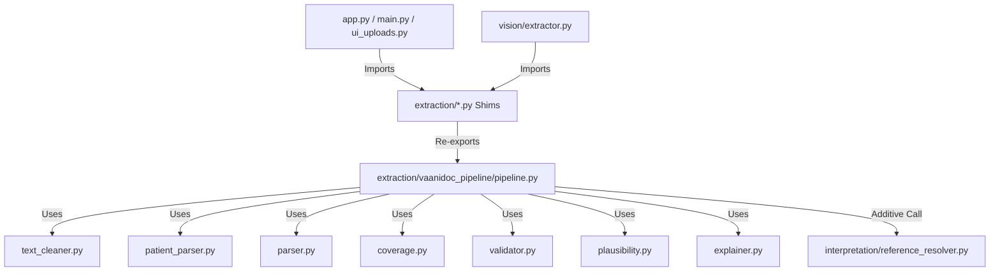

# VaaniDoc VERIFY Pipeline Dependency Mapping

## Package Import Relationships

## Shared Infrastructure Audit
- `vision/extractor.py` imports `extraction.pipeline`
- `vision/layout_parser.py` imports `extraction.parser`
- `app.py` / `ui_uploads.py` / `main.py` import `extraction.pipeline`

All imports remain 100% functional via backward-compatibility shims.
